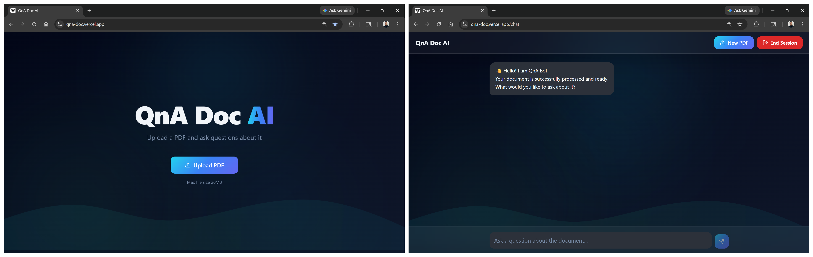
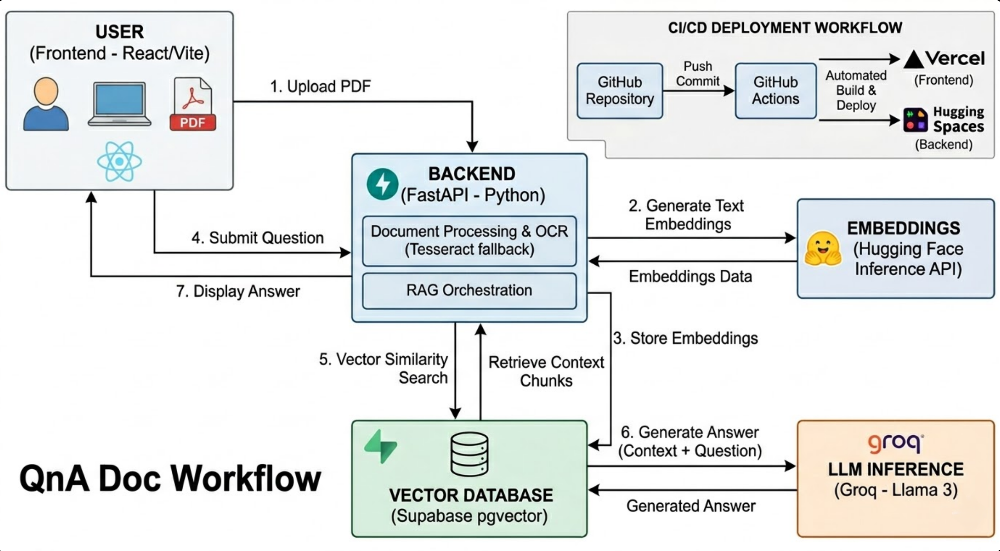

<div align="center">
  
  <h1>QnA Doc AI</h1>
  <h3>Intelligent PDF Assistant (RAG Pipeline)</h3>
</div>

<br/>
 
🎯 A full-stack Retrieval-Augmented Generation (RAG) application that allows users to upload PDF documents and have intelligent, context-aware conversations about the content. 

This project utilizes advanced vector embeddings, semantic search, and large language models, with a built-in OCR fallback for complex scanned documents.

## 📸 Application Interface

<div align="center">
  
</div>

<br/>

## 🔄 Workflow Diagram

<div align="center">
  
</div>

<br/>

## 🚀 Tech Stack

- **Frontend:** React, TypeScript, Vite, Tailwind CSS, Shadcn UI
- **Backend:** Python, FastAPI
- **Database:** PostgreSQL (Supabase) with `pgvector`
- **AI & Processing:** Groq (LLM Inference), HuggingFace (Embeddings), Tesseract/Poppler (OCR)

---

## 💻 Local Setup Instructions

To run this project locally, you must run both the backend API and the frontend client.

### Prerequisites
- Node.js (v18+) and Python (3.9+)
- [Tesseract OCR](https://github.com/UB-Mannheim/tesseract/wiki) (For scanned PDF processing)
- [Poppler](https://github.com/oschwartz10612/poppler-windows/releases) (For PDF-to-image conversion)

### 1. Backend Configuration (FastAPI)

1. Open a terminal and navigate to the backend directory:
   ```bash
   cd backend
   ```
2. Create and activate a Python virtual environment:
   ```bash
   python -m venv venv
   .\venv\Scripts\activate
   ```
3. Install dependencies:
   ```bash
   pip install -r requirements.txt
   ```
4. Create a `.env` file in the `backend` folder with your keys and exact local paths:
   ```env
   SUPABASE_URL=your_supabase_project_url
   SUPABASE_KEY=your_supabase_service_role_key
   HUGGINGFACEHUB_API_TOKEN=your_huggingface_token
   GROQ_API_KEY=your_groq_api_key
   
   # Update these paths to match where you installed/extracted them on your machine
   # Examples below show typical Windows installation paths:
   POPPLER_PATH=C:\path\to\poppler\Library\bin
   TESSERACT_PATH=C:\Program Files\Tesseract-OCR\tesseract.exe
   ```
5. Start the API server:
   ```bash
   uvicorn app.main:app --reload
   ```
   *The backend runs on `http://127.0.0.1:8000`*

### 2. Frontend Configuration (React)

1. Open a **new** terminal and navigate to the frontend directory:
   ```bash
   cd frontend
   ```
2. Install Node dependencies:
   ```bash
   npm install
   ```
3. Start the development server:
   ```bash
   npm run dev
   ```
   *The frontend runs on `http://localhost:8080`. API calls will automatically route to your local backend.*

---

## 🗄️ Database Architecture
This application requires a Supabase instance with the `pgvector` extension enabled. The database handles autonomous cleanup via a `pg_cron` job that permanently deletes vector embeddings and chat sessions older than 1 hour to ensure data privacy.

---

## ⚙️ Infrastructure Automation

To ensure continuous availability and prevent free-tier sleep cycles, this project utilizes scheduled GitHub Actions. A daily automated workflow sends a targeted heartbeat request to the backend. This setup serves two purposes:
1. Prevents the Hugging Face Space from entering its 48-hour inactivity sleep cycle.
2. Registers as an active external API connection to Supabase, bypassing the 7-day inactivity pause. 
This automated CI/CD pipeline ensures the application is always ready for user interaction without requiring manual wake-ups.